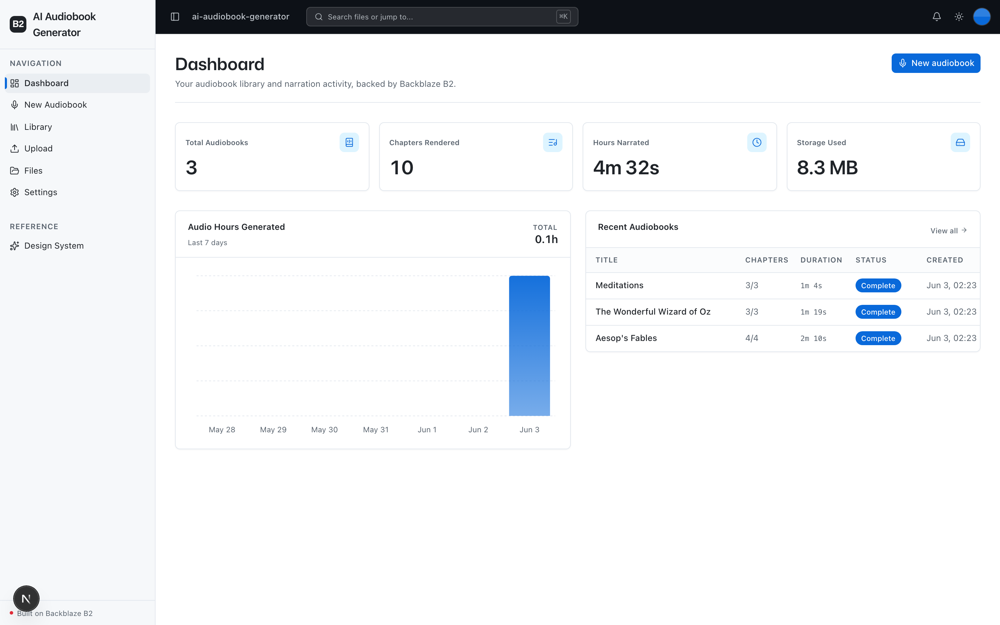
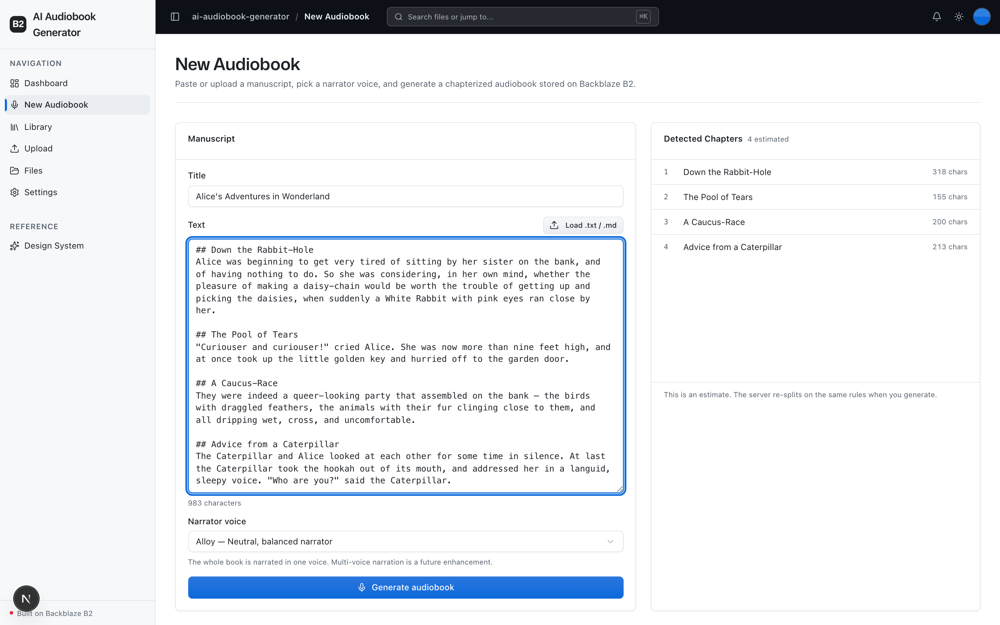
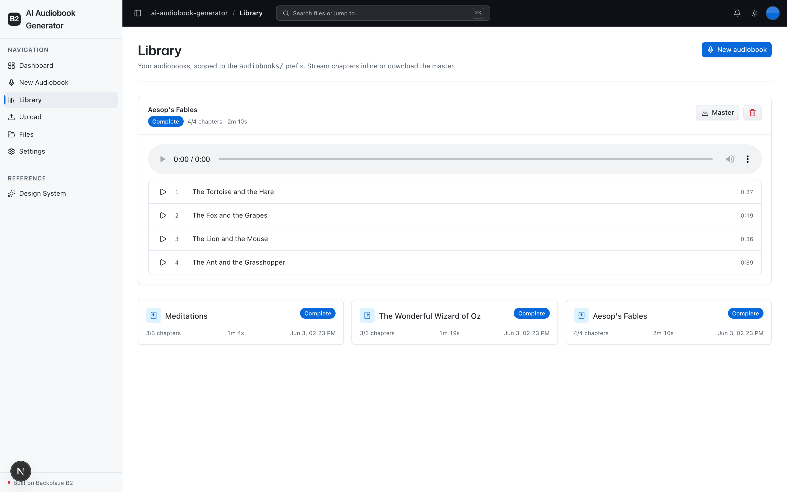
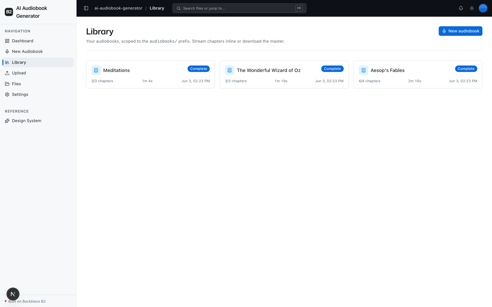

<!-- last_verified: 2026-06-03 -->
# AI Audiobook Generator

Turn a long manuscript — a book, an ebook, a blog series, or any pasted text —
into a narrated, chapterized audiobook, with the **source text, every per-chapter
audio render, and the final master all stored in a single [Backblaze B2](https://www.backblaze.com/sign-up/ai-cloud-storage?utm_source=github&utm_medium=referral&utm_campaign=ai_artifacts&utm_content=b2ai-audiobook-generator) bucket**.

This app exercises:

- **Long-running generation jobs** — chapters are narrated one by one in the background.
- **Many-object writes under a per-book prefix** — source, manifest, N chapter MP3s, and a master.
- **B2 as the sole datastore** — a JSON manifest per book; there is no database.
- **Streaming / Range reads** — the browser plays chapter audio straight from presigned B2 URLs.

## Screenshots

**Dashboard** — audiobook + narration metrics, a 7-day audio-hours chart, and recent books.



**New Audiobook studio** — paste or upload a manuscript and preview detected chapters live, then pick a narrator voice.



**Library (inline player)** — stream each chapter from a presigned B2 URL and download the chapterized M4B master.



**Library** — every audiobook, scoped to the `audiobooks/` prefix.



## What you get

- **New Audiobook studio** (`/create`) — paste or upload a manuscript, preview the
  detected chapters, pick a narrator voice, and generate.
- **Library** (`/library`) — a scoped explorer of your audiobooks with an inline
  HTML5 `<audio>` player that streams each chapter from a presigned B2 URL, plus
  one-click master download and delete.
- **Dashboard** (`/`) — total audiobooks, chapters rendered, hours narrated, storage
  used, an audio-hours-per-day chart, and recent audiobooks.
- **File Upload + Explorer** (`/upload`, `/files`) — the reusable B2 scaffolding:
  generic drag-and-drop upload and a full-bucket file browser.
- A FastAPI backend with a strict layered architecture, structural tests, and
  agent-optimized docs.

## How it works

```
audiobooks/<book-id>/source.txt          uploaded/pasted manuscript
audiobooks/<book-id>/manifest.json       job + chapter state  ->  B2 IS the datastore
audiobooks/<book-id>/chapters/ch-001.mp3 per-chapter TTS renders
audiobooks/<book-id>/master.m4b          final chapterized master (ffmpeg)
uploads/<file>                           generic Upload page (kept, unchanged)
```

1. `POST /books` splits the manuscript into chapters, writes `source.txt` + an
   initial `manifest.json` (status `pending`), and kicks off narration in the
   background.
2. For each chapter: synthesize audio with the TTS provider, write the MP3 to B2,
   read its duration, and rewrite the manifest.
3. When every chapter is rendered, assemble a chapterized **M4B** master with
   ffmpeg, write it to B2, and mark the book `complete`.
4. The Library polls `GET /books/{id}` while a job is in flight and streams each
   finished chapter from a presigned, non-attachment B2 URL.

All B2 access is **S3-compatible — there is no b2-native API anywhere**. A single
boto3 S3 client (signature v4, custom user agent `b2ai-audiobook-generator`) lives
in `services/api/app/repo/`.

## Agent-First Architecture

This repo is optimized for coding agents. **[AGENTS.md](AGENTS.md) is the single
source of truth** — a short entry point covering the repository layout,
architectural invariants, commands, and conventions. Architecture is enforced
mechanically (structural tests + lints), and docs live next to the code:

```
AGENTS.md              Single source of truth — layout, invariants, commands, conventions
ARCHITECTURE.md        System layout, layering rules, narration-job flow, data flows
docs/
  features/            Feature docs (narration, library, chapter-detection, master-assembly, ...)
  app-workflows.md     User journeys
  dev-workflows.md     Engineering workflows and testing
  SECURITY.md          Security principles
  RELIABILITY.md       Reliability expectations
  exec-plans/          Execution plans and tech debt tracker
```

## Quick Start

You need: Node.js >= 20, pnpm >= 9, Python >= 3.11, **ffmpeg** (for the M4B master),
a free **[Backblaze B2 account](https://www.backblaze.com/sign-up/ai-cloud-storage?utm_source=github&utm_medium=referral&utm_campaign=ai_artifacts&utm_content=b2ai-audiobook-generator)**,
and a text-to-speech provider key (OpenAI by default).

### Start a new project

```bash
git clone https://github.com/backblaze-b2-samples/ai-audiobook-generator.git my-audiobook-app
cd my-audiobook-app
rm -rf .git
git init && git add . && git commit -m "Initial commit"
```

### Setup

**1. Install dependencies**

```bash
pnpm install
```

**2. Install ffmpeg** (used to assemble the chapterized M4B master)

```bash
# macOS
brew install ffmpeg
# Debian / Ubuntu
sudo apt install ffmpeg
```

Per-chapter MP3s still render without ffmpeg; only the M4B master needs it.

**3. Set up the backend**

```bash
cd services/api
python -m venv .venv && source .venv/bin/activate
pip install -r requirements.txt
cd ../..
```

**4. Add your credentials**

```bash
cp .env.example .env
```

Open `.env` and fill in:

- From the [Backblaze B2 dashboard](https://secure.backblaze.com/b2_buckets.htm?utm_source=github&utm_medium=referral&utm_campaign=ai_artifacts&utm_content=b2ai-audiobook-generator):
  - **Create a bucket** → `B2_BUCKET_NAME`, **Endpoint** → `B2_ENDPOINT`, and the
    region segment of that endpoint (e.g. `us-west-004`) → `B2_REGION`.
  - **Create an application key** with `Read and Write` permission → **keyID** →
    `B2_APPLICATION_KEY_ID`, **applicationKey** → `B2_APPLICATION_KEY` *(shown once)*.
- Your TTS key: `OPENAI_API_KEY` for the default OpenAI provider. To use ElevenLabs
  instead, set `TTS_PROVIDER=elevenlabs`, run `pip install elevenlabs`, and set
  `ELEVENLABS_API_KEY`.

> Walkthroughs: [creating a bucket](https://www.backblaze.com/docs/cloud-storage-create-and-manage-buckets?utm_source=github&utm_medium=referral&utm_campaign=ai_artifacts&utm_content=b2ai-audiobook-generator) ·
> [creating app keys](https://www.backblaze.com/docs/cloud-storage-create-and-manage-app-keys?utm_source=github&utm_medium=referral&utm_campaign=ai_artifacts&utm_content=b2ai-audiobook-generator).

**5. Run it**

```bash
pnpm dev
```

Frontend at `localhost:3000`, API at `localhost:8000`. `pnpm dev` first runs
`pnpm doctor`, a preflight that checks Node/Python/pnpm versions, ffmpeg, the
venv, and your `.env` (missing or placeholder B2 vars), telling you exactly how
to fix each issue. Run it any time with `pnpm doctor`.

## Core Features

- [Chapter Narration](docs/features/narration.md) — manuscript → chapters → per-chapter TTS audio in B2
- [Library](docs/features/library.md) — scoped explorer with an inline streaming player + master download
- [Chapter Detection](docs/features/chapter-detection.md) — marker-aware + size-based splitting
- [Master Assembly](docs/features/master-assembly.md) — chapterized M4B via ffmpeg
- [Dashboard](docs/features/dashboard.md) — audiobook + narration metrics
- [Metadata Extraction](docs/features/metadata-extraction.md) — PDF info, audio duration/codec/bitrate, checksums
- [File Upload](docs/features/file-upload.md) and [File Browser](docs/features/file-browser.md) — kept B2 scaffolding
- [Design System](docs/design-system.md) — tokens, primitives, the blaze generating loader. Live at `/design`.

## Tech Stack

- TypeScript, Next.js 16, React 19, Tailwind v4, shadcn/ui, Recharts
- TanStack Query — caching, dedup, retry, and polling for in-flight narration jobs
- Python 3.11+, FastAPI, boto3 (S3-compatible), Pydantic v2, mutagen, openai
- ffmpeg (M4B master assembly)
- Backblaze B2 (S3-compatible object storage) — source, manifests, audio, and master
- pnpm workspaces (monorepo)

## Commands

| Command | What it does |
|---------|-------------|
| `pnpm dev` | Start frontend + backend |
| `pnpm dev:web` | Frontend only |
| `pnpm dev:api` | Backend only |
| `pnpm build` | Build frontend |
| `pnpm lint` | Lint frontend |
| `pnpm lint:api` | Lint backend (ruff) |
| `pnpm test:api` | Run backend tests |
| `pnpm check:structure` | Verify layering rules |
| `pnpm test:e2e` | Playwright e2e tests (run `pnpm --filter @ai-audiobook-generator/web exec playwright install chromium` once first) |

## Documentation Map

| Doc | Purpose |
|-----|---------|
| [AGENTS.md](AGENTS.md) | Agent table of contents — start here |
| [ARCHITECTURE.md](ARCHITECTURE.md) | System layout, layering, narration-job flow, data flows |
| [docs/features/](docs/features/) | Feature docs |
| [docs/app-workflows.md](docs/app-workflows.md) | User journeys |
| [docs/dev-workflows.md](docs/dev-workflows.md) | Engineering workflows and testing |
| [docs/SECURITY.md](docs/SECURITY.md) | Security principles |
| [docs/RELIABILITY.md](docs/RELIABILITY.md) | Reliability expectations |
| [docs/exec-plans/](docs/exec-plans/) | Execution plans and tech debt tracker |

## License

MIT License — see [LICENSE](LICENSE) for details.

## Claude Agent B2 Skill

Manage Backblaze B2 from your terminal using natural language (list/search, audits,
stale or large file detection, security checks, safe cleanup).

Repo: [https://github.com/backblaze-b2-samples/claude-skill-b2-cloud-storage](https://github.com/backblaze-b2-samples/claude-skill-b2-cloud-storage)
